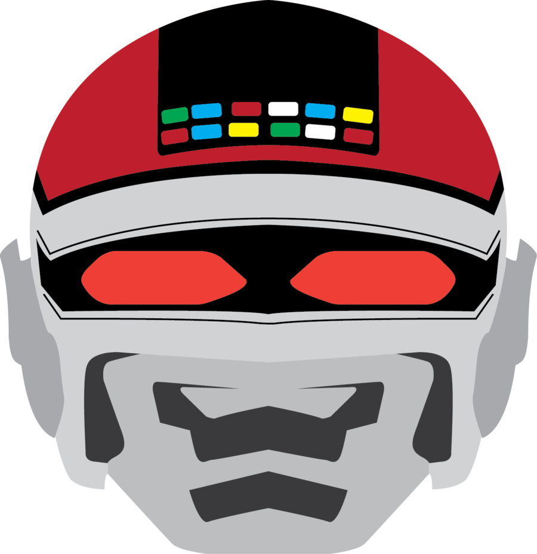
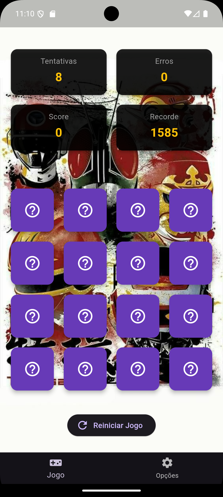
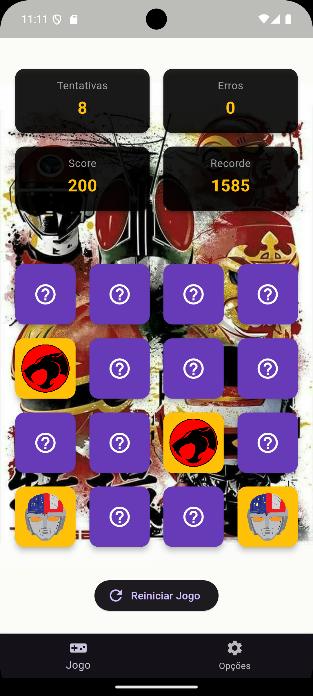
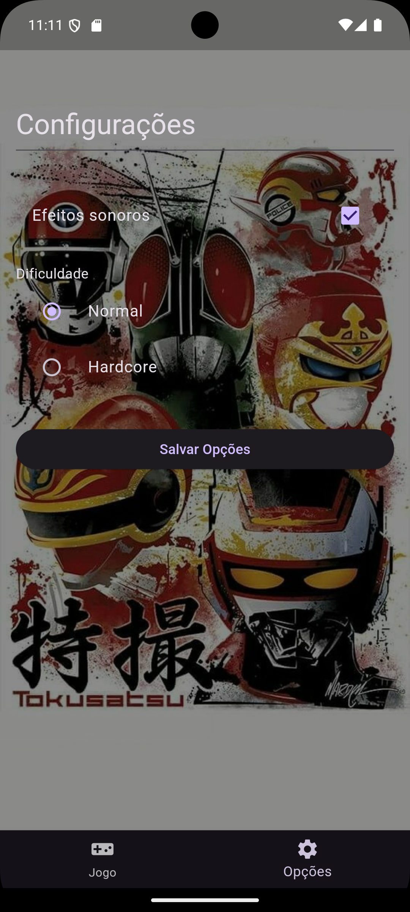
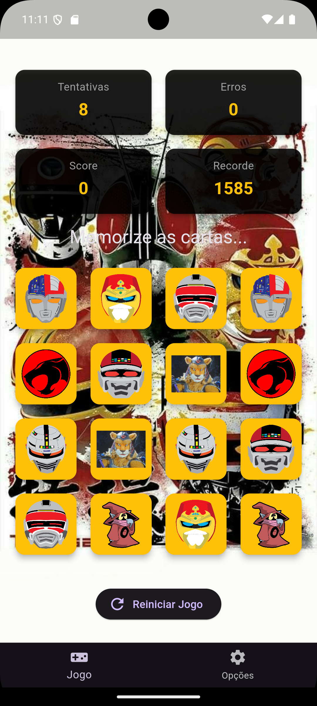

# Memory Match Game (Flutter)

<p align="center">
  
</p>

---

## Sobre o projeto

O **Memory Match Game** é um jogo de memória desenvolvido em Flutter, onde o objetivo é encontrar todos os pares de cartas iguais.

O jogo inclui sistema de pontuação, níveis de dificuldade, efeitos sonoros e persistência de dados (recordes e configurações).

---

## Objetivo

* Encontrar todos os pares de cartas iguais
* Fazer a maior pontuação possível
* Bater o recorde salvo no dispositivo

---

## Mecânica do jogo

* O jogador vira duas cartas por vez
* Se forem iguais, permanecem viradas
* Se forem diferentes, voltam após 1 segundo
* O jogo termina ao encontrar todos os pares ou acabar as tentativas

---

## Sistema de pontuação

* +100 pontos por acerto
* -50 pontos por erro
* Bônus final baseado em:

  * tempo de conclusão
  * quantidade de erros

O recorde é salvo automaticamente usando `shared_preferences`.

---

## Dificuldade

O jogo possui dois modos:

### 🟢 Normal

* 8 tentativas
* tempo maior de memorização

### 🔴 Hardcore

* 4 tentativas
* maior desafio

---

## Áudio

O jogo possui efeitos sonoros para:

* acertos ✔
* erros ❌

Pode ser ativado/desativado nas configurações.

---

## Telas do app

<p align="center">
  
  
  
  
</p>

### Jogo

* Grid de cartas
* Score em tempo real
* Tentativas restantes
* Erros
* Recorde
* Botão de reiniciar

---

### Configurações

* Checkbox: ativar/desativar som
* Radio buttons: dificuldade
* Botão de salvar configurações
* Feedback via SnackBar

---

## Navegação

O app utiliza `BottomNavigationBar` com duas abas:

* Jogo
* Configurações

---

## Persistência de dados

Utiliza `shared_preferences` para salvar:

* Recorde (high score)
* Som ativado/desativado
* Dificuldade escolhida

---

## Estrutura do projeto

```

lib/
├── config/
│    └── game_theme.dart
│
├── services/
│    ├── audio_service.dart
│    └── preferences_service.dart
│
├── screens/
│    ├── game_screen.dart
│    ├── settings_screen.dart
│    └── main_navigation_screen.dart
│ 
├── widgets/
│    └── card_counter.dart
│ 
├── main.dart

```

---

## Tecnologias utilizadas

* Flutter
* Dart
* Material Design
* shared_preferences
* audioplayers

---

## Como executar o projeto

```bash
flutter pub get
flutter run
```

---

## Funcionalidades

* ✔ Jogo de memória completo
* ✔ Sistema de pontuação
* ✔ Recorde persistente
* ✔ Dois níveis de dificuldade
* ✔ Áudio configurável
* ✔ Navegação com BottomNavigationBar
* ✔ Interface responsiva
* ✔ Feedback ao usuário (AlertDialog e SnackBar)

---

## Conclusão

Este projeto demonstra o uso de Flutter com:

* widgets stateful e stateless
* navegação entre telas
* persistência local
* interação com usuário
* controle de estado de jogo

---

## Autor

Projeto desenvolvido como atividade acadêmica em Flutter, para fins não comercias.

---

## Créditos das imagens

As imagens utilizadas neste projeto foram obtidas de fontes públicas na internet (Google Images e sites de fãs), sendo utilizadas exclusivamente para fins acadêmicos e sem qualquer finalidade comercial.

Todos os direitos pertencem aos seus respectivos autores.
